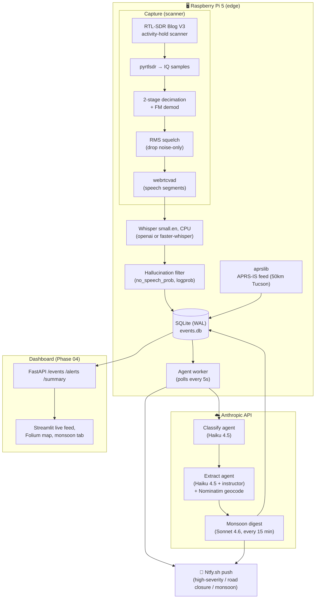

# Monsoon Ears

> *Listening to Tucson — one transmission at a time.*

**Monsoon Ears** is a multi-agent radio intelligence pipeline that listens to live emergency frequencies in Tucson, Arizona on a Raspberry Pi 5 + a $40 software-defined radio. It captures analog FM voice, transcribes it locally with Whisper, classifies and extracts structured incident data with an LLM agent graph, and during monsoon season correlates flood-control radio dispatches with distributed APRS weather-station rainfall data to synthesize real-time flash-flood alerts.

It is an exercise in three things at once: low-level DSP on commodity hardware, multi-agent LLM orchestration, and edge ↔ cloud architectural trade-offs.

## Status

| Phase | Scope | State |
|---|---|---|
| 01 | Pi setup, SDR validation, frequency research | ✅ Done |
| 01.5 | op25 install for P25 Phase II trunked digital | ✅ op25 built on Pi; **PCWIN locked & decoding end-to-end** (NAC 0x3b1, SYSID 0x3bb) — talkgroup-tagged P25 rows flow through the pipeline via the UDP audio bridge |
| 02 | Capture → squelch → VAD → Whisper → SQLite | ✅ Done |
| 03 | Multi-freq scanner + LangGraph classify/extract/alert + APRS-IS + Ntfy push | ✅ Done |
| 04 | FastAPI + Streamlit dashboard with live feed, Folium map, monsoon tab, NL→SQL | ✅ Done |
| 05 | systemd units for every always-on service (incl. API + dashboard) | ✅ Done |
| 06+ | Single-dongle SDR supervisor + Band Manager, P25 leg live, leg-failure watchdog, NWS watches/warnings in the digest, selectable faster-whisper backend | ✅ Done |

Live captures already include verified Tucson Rural Metro / AMR dispatch traffic — e.g. `"Med 843, respond code 2, TC unknown, 205 West Irvington Road"` (a real EMS dispatch to a traffic collision, structured-extracted as `units=['Med 843']`, `locations=['205 W Irvington Rd']`, `severity=medium`) and `"Heart problem, 55."` (cardiac call, auto-classified as `severity=high` → Ntfy push delivered to phone). On a non-monsoon test day the Sonnet 4.6 digest agent correctly read 27 voice rows plus 13 APRS weather station packets, tabulated rainfall (`0.00 in` across the sensor network), and concluded "flash flood risk is negligible at this time" — cross-source reasoning with citations.

## What's interesting about it

- **Three parallel decode paths, one agent graph.** Analog FM voice, P25 Phase II trunked digital (live on PCWIN via op25), and APRS-IS packet data all converge on a single LangGraph pipeline. Each has a different physical-layer decoder; the downstream intelligence is identical.
- **Activity-hold frequency scanner.** A single $40 dongle can only tune one channel at a time, so the scanner probes each priority frequency for ~1 s using RMS-domain squelch, holds when signal appears, and resumes scanning after a configurable hangover. Periodically suspends scanning to visit NOAA Weather Radio for forecast context. The probe audio is prepended to the first hold chunk so short transmissions don't slip between cycles.
- **One dongle, scheduled — an SDR supervisor with a hybrid "Band Manager."** Analog FM and P25/PCWIN can't both hold the SDR at once, so a single supervisor process owns the device and time-shares the two RF legs: it runs one, holds it for an assigned dwell window, then cleanly tears it down (so the SDR fully releases) and switches. The split comes from a Band Manager that's deterministic by default (a P25-primary rota that always works, no LLM) but, when enabled, lets a cheap model re-weight the dwell from live conditions already in the DB — rising stream-gauge discharge, recent flood/fire/EMS traffic, monsoon season — camping on PCWIN when flooding looks active and widening the analog sweep when it's quiet. The agent can only *tune* the rota: its output is clamped and any failure falls back to the deterministic plan. The whole loop is dependency-injected (fake processes + fake clock), so it's unit-tested without an SDR.
- **Multi-stage signal gating.** A coarse RMS-domain squelch drops noise-only chunks (free), then WebRTC VAD finds speech boundaries inside the survivors (cheap), and only then does Whisper run (expensive). Wasted GPU-equivalent compute is minimized at every layer.
- **Whisper hallucination filtering.** Whisper is notorious for emitting ghost text on silence (lone CJK characters, "you", "Thanks for watching!"). The pipeline uses Whisper's own per-segment `no_speech_prob`, `avg_logprob`, and `compression_ratio` to drop these before they reach the database.
- **Decoupled agent worker.** A separate Pi-side process polls SQLite for unclassified rows, runs a LangGraph DAG (`classify` → `extract` → `alert`) with Anthropic Haiku 4.5 via `instructor` (structured Pydantic output), geocodes locations via cached Nominatim, and pushes high-severity events to Ntfy.sh. Decoupling means Anthropic outages just backlog the queue instead of breaking capture.
- **APRS-IS instead of a 2nd dongle.** APRS data comes from the public APRS-IS internet feed via `aprslib` with a server-side Tucson-area filter — broader coverage than a single antenna would deliver, no extra hardware, no cost.
- **The monsoon correlation feature.** Every 15 minutes a Sonnet 4.6 digest agent reads the last hour of fire/EMS/flood-control voice traffic, the last 30 minutes of APRS weather packets, **real-time stream/rain-gauge readings** (USGS Water Services + best-effort Pima County ALERT), **and active NWS watches/warnings** (api.weather.gov) and decides whether they look correlated. An official NWS Flash Flood Warning is the strongest signal and anchors the verdict; stream discharge on a named wash is next (perennial-effluent reaches like the Santa Cruz at Cortaro are flagged so steady baseflow isn't mistaken for a flood). On a non-flood day, it correctly returns "no active situation" with a tabular summary of all sensor readings and event IDs it considered. This is the showcase capability.
- **Edge ingestion + cloud reasoning, deliberately.** Capture, transcription, and structured extraction run on a $90 device that sits on the network indefinitely. Only the Anthropic API calls (classify/extract per event + Sonnet digest every 15 min) leave the LAN. The split mirrors how production IoT + AI systems are actually built.

## Architecture



## Target frequencies

| Frequency | Source | Pipeline | Status |
|---|---|---|---|
| 154.370 MHz | Rural Metro Fire / AMR — Dispatch | Analog FM | ✅ Validated |
| 153.815 MHz | Rural Metro EMS Dispatch | Analog FM | Planned |
| 162.3975 MHz | NOAA Weather Radio Tucson | Analog FM | ✅ Validated (calibration source) |
| 144.390 MHz | APRS 2m national | Packet (AFSK1200) | ⏳ Awaits 2nd dongle |
| 853.625 MHz | PCWIN Simulcast A control channel | P25 Phase II | ✅ Live — op25 locked & decoding PCWIN through the pipeline (UDP audio bridge) |

Tucson Fire Department, all of Pima County major fire/EMS, and the county EOC operate on **PCWIN** (Project 25 Phase II trunked digital). Tucson PD and Marana PD talkgroups are encrypted and out of scope. Verified frequencies and the priority talkgroup catalog are in [`config/frequencies.py`](./config/frequencies.py) (`PCWIN`, `PCWIN_TALKGROUPS`); the op25 build/run runbook is [`deploy/op25_setup.md`](./deploy/op25_setup.md).

## Hardware

- Raspberry Pi 5 (8 GB), active cooler, 27 W USB-C PSU, 64 GB A2 microSD
- RTL-SDR Blog V3 + dipole antenna kit
- Headless, SSH-only, no monitor

A single RTL-SDR can only tune one frequency at a time, so the SDR supervisor time-shares it between the analog scanner and P25/PCWIN (one RF leg at a time — see the Band Manager note above). APRS does **not** compete for the dongle: it arrives over the public APRS-IS internet feed, so no second radio is needed.

## Stack

| Layer | Tools |
|---|---|
| Capture | `pyrtlsdr`, `numpy`, `scipy` |
| Speech detection | `webrtcvad` |
| Transcription | `openai-whisper` (`small` model, CPU) |
| Storage | `SQLModel` + SQLite (WAL mode) |
| Schemas | `pydantic` v2 |
| Agents *(Phase 03)* | `langgraph`, `anthropic`, `instructor` |
| API *(Phase 04)* | `fastapi`, `uvicorn`, `sqlglot` |
| Dashboard | React SPA (`web/` — Vite, TanStack Query, react-leaflet, Recharts), served by FastAPI |
| Env | `uv` (venv + lockfile), `python-dotenv` |

## Quick start

### On the Raspberry Pi (production)

```bash
git clone https://github.com/keatonwilson/monsoon_ears.git
cd monsoon_ears
uv venv
uv pip install -e ".[pi,dev]"
cp .env.example .env  # adjust as needed
uv run python -m ingestion.runner_analog
```

First run downloads the Whisper `small` model (~244 MB) to `~/.cache/whisper/` — subsequent runs reuse it. Cold transcription cycle is ~22 s for an 8 s chunk on Pi 5 CPU (~1.8× real-time). The `pi` extras include `pyrtlsdr`, `openai-whisper`, `webrtcvad`, and `aprslib`.

For the full stack, run five processes on the Pi (Phase 05 wraps these in systemd):

```bash
# Ingestion
uv run python -m ingestion.runner_analog                          # Scanner → Whisper → DB
uv run python -m agents.worker                                    # Classify → extract → alert
APRS_IS_ENABLED=true uv run python -m ingestion.aprs_is_client    # APRS-IS feed

# Read interface (also serves the React dashboard from web/dist)
./scripts/run_api.sh                                              # FastAPI :8000
```

Then any device on the LAN points its browser at `http://monsoon-ears.local:8000`. The agent worker also runs the Sonnet 4.6 monsoon-correlation digest every `DIGEST_INTERVAL_MIN` minutes via APScheduler — the dashboard's monsoon tab surfaces its most recent verdict.

The dashboard is a React SPA in [`web/`](./web). Build it on the dev Mac (`cd web && npm run build`) and rsync the repo to the Pi (`scripts/sync_to_pi.sh` carries `web/dist/`); FastAPI serves it from the same port as the API, so there is no separate dashboard process. See [`web/README.md`](./web/README.md) for development.

### Auto-start with systemd

The always-on backend processes (SDR supervisor, agent worker, APRS-IS feed, gauge poller) ship as systemd units in [`deploy/systemd/`](./deploy/systemd) so the Pi recovers them after a crash or reboot. Install them once, from the repo root on the Pi:

```bash
sudo deploy/install_services.sh
```

The script symlinks the units out of the repo (so `git pull` keeps them current), runs `daemon-reload`, and `enable --now`s `monsoon-sdr`, `monsoon-worker`, `monsoon-aprs`, `monsoon-gauges`, and `monsoon-api`. Each is `Restart=on-failure`, reads secrets from `.env` via `EnvironmentFile`, and runs as user `keaton`. Watch them with:

```bash
systemctl status monsoon-sdr monsoon-worker monsoon-aprs monsoon-gauges monsoon-api
journalctl -u monsoon-sdr -f
```

`monsoon-sdr` owns the dongle and runs the analog/P25 legs itself — so `monsoon-runner` and `monsoon-p25` are **not** enabled directly (they'd fight for the SDR); they remain for manual/debug runs of a single path. Which legs the supervisor will run is gated by `SDR_ENABLE_*` in `.env`. `monsoon-aprs` only does work when `APRS_IS_ENABLED=true` in `.env` — otherwise it exits cleanly and stays inactive. The FastAPI read-interface runs as the `monsoon-api` service (wrapping `scripts/run_api.sh`) and serves both the JSON API and the React dashboard, so it survives a reboot.

### Port table

| Port | Process | Role |
|---|---|---|
| 8000 | FastAPI / uvicorn | Read-only JSON API (`/events`, `/aprs`, `/gauges`, `/weather/alerts`, `/summary`, `/alerts`, `/query`) + React dashboard (`web/dist`) |

### Remote access (Tailscale)

For access away from the LAN, put the Pi on a tailnet — no app changes needed (the SPA uses relative URLs):

```bash
curl -fsSL https://tailscale.com/install.sh | sh   # once
sudo tailscale up
sudo tailscale set --hostname monsoon-ears
```

With MagicDNS, browse to `http://monsoon-ears:8000` from any device on the tailnet.

### Natural-language query box

The dashboard's "Ask" tab posts your question to `/query`. Behind the scenes:

1. Haiku 4.5 rewrites the question into a single `SELECT` (structured output via `instructor`).
2. `sqlglot` parses the candidate. Anything that isn't a single `SELECT` over `{transcription_events, aprs_events, alerts}` is rejected (`DROP`, `INSERT`, `UPDATE`, `PRAGMA`, `ATTACH`, multi-statement, unknown tables — see [`api/nl_sql.py`](./api/nl_sql.py)).
3. `LIMIT 200` is enforced.
4. SQLite executes via a separate read-only connection (`?mode=ro&uri=true`) with a 5-second watchdog.

The generated SQL is shown in the UI so you can audit what ran.

### Wash overlay

The map tab renders Pima County Regional Flood Control District's major-wash polylines as an overlay. Refresh with:

```bash
uv run python scripts/fetch_washes.py
```

(Output `data/washes.geojson` is committed.)

### On a development machine (tests + DSP only)

```bash
uv venv
uv pip install -e ".[dev]"
uv run pytest -v
```

The `pi` extras are intentionally skipped because PyTorch does not publish an Intel-Mac wheel and there is no SDR to read from anyway.

### Pi → Mac iteration loop

```bash
# Mac side: rsync the worktree to the Pi (skips .venv, .git, .env, data/)
./scripts/sync_to_pi.sh
```

`git` is the canonical history; `rsync` is for tight dev iteration during a debug session.

## Configuration

All runtime tuning lives in `.env` — see [`.env.example`](./.env.example). The non-obvious knobs:

| Variable | Default | What it does |
|---|---|---|
| `NOISE_FLOOR_RMS` | `0.65` | Post-demod RMS gate. Below = signal present; above = noise. The RTL-SDR AGC flattens IQ-domain power, so post-demod structure is the discriminator. Empirically NOAA carrier ≈ 0.27, idle ≈ 0.87. |
| `CHUNK_DURATION_SEC` | `15` | Window pulled from the SDR per capture cycle. Longer → fewer mid-utterance cuts, more wasted compute on silence. VAD inside the window handles the trade-off. |
| `VAD_AGGRESSIVENESS` | `2` | webrtcvad 0–3 scale. Higher = more likely to flag noisy speech as speech. `2` is the right setting for noisy radio. |
| `VAD_MIN_SEGMENT_MS` | `800` | Drop speech segments below this length — filters key-up blips that survive the squelch. |
| `WHISPER_BACKEND` | `openai` | Decode engine: `openai` (reference, PyTorch) or `faster` (faster-whisper / CTranslate2 — 3–4× quicker on Pi 5 CPU at int8, makes `medium` feasible). Benchmark with `scripts/benchmark_whisper.py`. |
| `WHISPER_MODEL` | `small` | `tiny` / `base` / `small` / `medium`. `small` is the sweet spot on Pi 5 CPU with the `openai` backend; `faster` opens the door to `medium`. |
| `WHISPER_COMPUTE_TYPE` | `int8` | faster-whisper only: `int8` / `int8_float16` / `float16` / `float32`. `int8` is the fast CPU path. |
| `SCAN_PROBE_SEC` | `1.0` | How long the scanner listens on each freq before deciding "signal present." Probe audio is prepended to the first HOLD chunk so short bursts aren't lost. |
| `SCAN_HANGOVER_CHUNKS` | `1` | Consecutive squelched chunks before HOLD releases and the scan resumes. Raise to 2+ on channels with intra-transmission pauses. |
| `SCAN_MAX_HOLD_SEC` | `120` | Hard cap on time held on one frequency — prevents a stuck carrier from deadlocking the scan. |
| `SCAN_MIN_PRIORITY` | `high` | Priority floor for the scan list (`primary` / `high` / `medium` / `low`). NOAA is excluded regardless. |
| `NOAA_VISIT_INTERVAL_MIN` | `15` | Periodic visit to NOAA Weather Radio for forecast context — scanner suspends rotation, captures `NOAA_VISIT_DURATION_SEC`, returns to scanning. |
| `DIGEST_INTERVAL_MIN` | `15` | Cadence of the Sonnet 4.6 monsoon-correlation digest job. |
| `APRS_IS_FILTER` | `r/32.2/-110.9/50` | APRS-IS server-side filter — circular radius around a point (50 km from downtown Tucson by default). |
| `APRS_IS_CALLSIGN` | `N0CALL` | APRS-IS login. Set to your own licensed callsign to be a good citizen (anonymous `N0CALL` clients may be filtered). |
| `APRS_IS_PASSCODE` | `-1` | `-1` = receive-only (identifies you, no packet injection). Only set a real verified passcode if you ever need to transmit — we never do. |

## Project layout

```
monsoon-ears/
├── ingestion/           # SDR capture, DSP, VAD, Whisper, APRS-IS
│   ├── capture_analog.py    # pyrtlsdr → FM demod → squelch, retunable
│   ├── scanner.py           # activity-hold multi-freq scanner + NOAA visits
│   ├── preprocess.py        # 300–3400 Hz bandpass + normalize
│   ├── vad.py               # webrtcvad-based speech segmentation
│   ├── transcribe.py        # Whisper + hallucination filter
│   ├── runner_analog.py     # main capture-to-DB loop (drives scanner)
│   └── aprs_is_client.py    # APRS-IS internet feed → APRS event rows
├── agents/              # LangGraph DAG + agent worker
│   ├── classify.py          # Haiku 4.5 → TransmissionType + confidence
│   ├── extract.py           # Haiku 4.5 → locations/units/severity + geocode
│   ├── alert.py             # Rule eval, Ntfy push, Sonnet monsoon digest, persistence
│   ├── graph.py             # LangGraph StateGraph (classify → extract → alert)
│   └── worker.py            # Poll DB, run graph, run scheduled digest
├── api/                 # FastAPI read interface (also serves the SPA)
│   ├── main.py              # app + router wiring + web/dist static mount
│   ├── deps.py              # read-only engine, settings
│   ├── nl_sql.py            # Haiku → SELECT → sqlglot validator → ro execute
│   └── routes/              # /events, /aprs, /summary, /alerts, /query, /washes
├── web/                 # React dashboard (Vite + TS + Tailwind + shadcn/ui)
│   ├── src/api/             # typed client + TanStack Query hooks
│   ├── src/lib/             # AZ time, palette, channel labels, URL state
│   ├── src/components/      # chips, StatusBar, shadcn ui/
│   └── src/pages/           # Threads, Hourly, Feed, Map, Activity, Monsoon, Ask
├── models/schemas.py    # Pydantic event models (Transcription/Classified/Extracted/APRS/Alert)
├── db/                  # SQLModel + WAL SQLite + alerts table + UPDATE helpers
├── data/washes.geojson  # Pima County wash polylines (committed)
├── config/frequencies.py
├── scripts/
│   ├── sync_to_pi.sh        # rsync helper
│   ├── smoke_capture.py     # 30-sec capture-only sanity check
│   ├── fetch_washes.py      # Pima County GIS → data/washes.geojson
│   └── run_api.sh           # uvicorn entrypoint (API + dashboard)
├── tests/               # pytest, 74 tests passing as of Phase 04
└── .claude/             # Long-form spec + Claude Code build plans
```

## Engineering notes worth seeing

- [`ingestion/capture_analog.py`](./ingestion/capture_analog.py) — two-stage decimation (1.024 MS/s → 64 kHz → 16 kHz) with quadrature FM demod and the *inverted-RMS* squelch. The squelch is inverted from intuition because the FM demodulator's output on pure noise is uniformly distributed in [-π, π] with very high RMS, while real signal produces low-RMS voice waveforms. The naïve "high RMS = signal" gate was wrong; calibration against the always-on NOAA broadcast made it obvious.
- [`ingestion/scanner.py`](./ingestion/scanner.py) — activity-hold state machine on a single dongle. Probes each priority frequency, holds when signal appears, exits on hangover or hard timeout, periodically suspends scanning to visit NOAA for forecast context. The probe audio is prepended to the first HOLD chunk so very short transmissions aren't lost in the silence that follows the key-down — discovered while debugging "scanner correctly HOLDs but emits no transcripts." Backend is injectable so the entire state machine is unit-testable without an SDR.
- [`ingestion/vad.py`](./ingestion/vad.py) — WebRTC VAD with two rounds of hysteresis (merge gaps < 300 ms because that's inter-word; drop segments < 800 ms because those are key-up blips). Turns a fixed 15 s wall-clock window into 0–N speech-bounded sub-clips.
- [`ingestion/transcribe.py`](./ingestion/transcribe.py) — uses Whisper's own per-segment `no_speech_prob`, `avg_logprob`, and `compression_ratio` thresholds (the same ones the reference Whisper implementation uses internally for silence detection) to drop ghost outputs before they hit the DB.
- [`agents/extract.py`](./agents/extract.py) — Haiku 4.5 via `instructor` returning a Pydantic schema, plus cached Nominatim geocoding. Disk cache prevents repeated lookups for the same address; the 1 req/sec rate limit honors Nominatim's published policy. The prompt seeds the model with named Tucson washes (Rillito, Pantano, Santa Cruz, Tanque Verde, Sabino, Cañada del Oro) and common dispatch shorthand (`code 2`, `TC`) so the model recognizes them as entities, not ordinary words.
- [`agents/alert.py`](./agents/alert.py) — the monsoon correlation digest. Fetches recent fire/EMS/flood-control voice + APRS weather, renders both into a single Sonnet prompt with placeholders verbatim from the project spec, returns a structured `AlertDecision`. On a dry test day Sonnet produced a tabular APRS sensor summary, geographic reasoning about the Santa Cruz River corridor, and a quantitative "negligible flood risk" conclusion citing event IDs.

## Roadmap

### Phase 03 — Agent graph ✅

- ✅ Activity-hold multi-frequency scanner with NOAA periodic visits
- ✅ LangGraph DAG: `TranscriptionEvent → classify → extract → alert`
- ✅ `classify` (Haiku 4.5 via `instructor`): emit `TransmissionType` + confidence
- ✅ `extract` (Haiku 4.5): pull locations, callsigns, units, status codes, severity. Geocode locations with cached `geopy` + Nominatim. Tucson washes as named-entity hints.
- ✅ `alert` (rule-based): high severity / road closure → Ntfy.sh push
- ✅ `alert` (Sonnet 4.6, every 15 min via APScheduler): monsoon correlation digest
- ✅ APRS-IS feed via `aprslib` (internet-aggregated APRS, no second dongle)
- ✅ 48 tests passing on Mac and Pi

### Phase 04 — FastAPI + dashboard ✅

- ✅ FastAPI on `:8000` with `/events`, `/events/{id}`, `/aprs`, `/summary`, `/alerts`, `/query`
- ✅ Dashboard — live feed (auto-refresh), map with color-coded incidents + APRS station markers, 24 h activity chart, monsoon correlation tab. Originally Streamlit on `:8501`; replaced by the React SPA in `web/` served from `:8000` (silent background refresh, dark mode, URL-persisted filters)
- ✅ Pima County wash polylines overlay (32 features, fetched from `gisdata.pima.gov`)
- ✅ NL→SQL query box backed by Haiku 4.5 + `sqlglot` validator + read-only SQLite
- ✅ Alerts persisted to a new `alerts` table so the dashboard shows history without re-calling Sonnet
- ✅ 48 → 74 tests passing

### Phase 05 — Polish

- README demo GIF / video (ideally during an actual storm)
- `systemd` services for runner / worker / APRS-IS so the Pi auto-recovers from reboots
- pytest fixtures: 20 frozen transcripts + 10 APRS packets
- APRS temperature unit fix (some CWOP stations report °C; `aprslib` doesn't normalize)
- Whisper hallucination → false-positive HIGH severity (see id=27 in current data) — extra guard at the classify stage

### Beyond Phase 05

- **op25 install** → adds the entire PCWIN P25 universe (TFD, county EOC) to the same agent graph
- **`faster-whisper`** to ditch the ~5 GB CUDA libs Torch ships even on a CPU-only Pi
- ✅ **Stream/rain-gauge data source** (USGS Water Services + best-effort Pima County ALERT) — done, feeds the monsoon digest
- **Local 7B LLM on a Mac mini / NUC** to eliminate ongoing API costs

## Cost (running 24/7)

| Item | Monthly |
|---|---|
| Pi 5 8 GB (amortized 24 mo) | ~$9 |
| RTL-SDR V3 (amortized 24 mo) | ~$2 |
| Electricity (~5 W avg) | ~$0.40 |
| Anthropic API — Haiku classify/extract | ~$8–12 |
| Anthropic API — Sonnet 15-min summaries | ~$2–3 |
| **Total** | **~$22–27 / mo** |

## Legal note

Receive-only monitoring of unencrypted public-safety frequencies does not require a ham license. The pipeline only ingests channels that are confirmed unencrypted (Rural Metro, AMR, NOAA, NWS, public-safety APRS). Tucson PD and Marana PD talkgroups are AES-encrypted (`TE` mode) and explicitly excluded in [`config/frequencies.py`](./config/frequencies.py).
