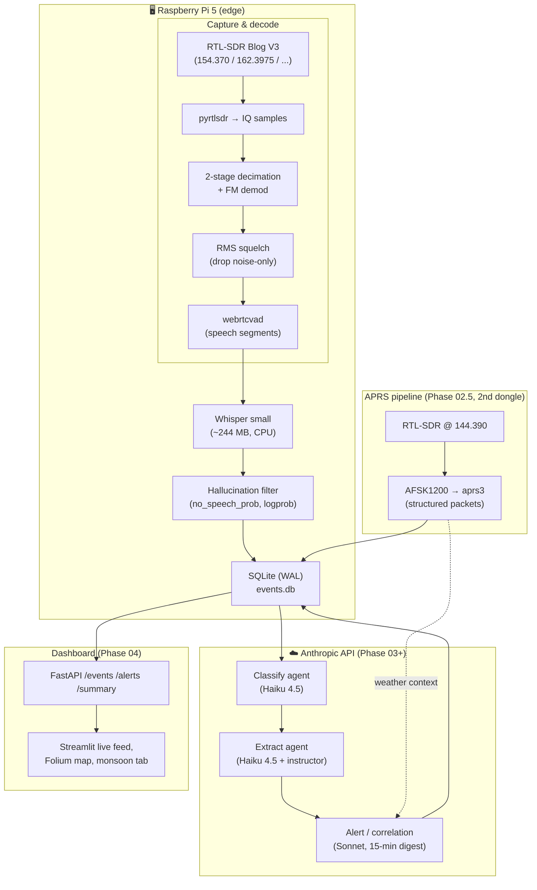

# Monsoon Ears

> *Listening to Tucson — one transmission at a time.*

**Monsoon Ears** is a multi-agent radio intelligence pipeline that listens to live emergency frequencies in Tucson, Arizona on a Raspberry Pi 5 + a $40 software-defined radio. It captures analog FM voice, transcribes it locally with Whisper, classifies and extracts structured incident data with an LLM agent graph, and during monsoon season correlates flood-control radio dispatches with distributed APRS weather-station rainfall data to synthesize real-time flash-flood alerts.

It is an exercise in three things at once: low-level DSP on commodity hardware, multi-agent LLM orchestration, and edge ↔ cloud architectural trade-offs.

## Status

| Phase | Scope | State |
|---|---|---|
| 01 | Pi setup, SDR validation, frequency research | ✅ Done |
| 01.5 | op25 install for P25 Phase II trunked digital | ⏳ Deferred — analog pipeline validated first |
| 02 | Capture → squelch → VAD → Whisper → SQLite | ✅ Done |
| 03 | LangGraph classify → extract → alert agents | 🚧 In progress |
| 04 | FastAPI + Streamlit dashboard | ⏳ Planned |
| 05 | Polish, systemd services, demo | ⏳ Planned |

Live captures already include verified Tucson Rural Metro / AMR dispatch traffic — e.g. `"Med 843, respond code 2, TC unknown, 205 West Irvington Road"` (a real EMS dispatch to a traffic collision) and `"Heart problem, 55."` (an EMS cardiac call).

## What's interesting about it

- **Three parallel decode paths, one agent graph.** Analog FM voice, P25 Phase II trunked digital (planned), and APRS packet data all converge on a single LangGraph pipeline. Each has a different physical-layer demodulator; the downstream intelligence is identical.
- **Multi-stage signal gating.** A coarse RMS-domain squelch drops noise-only chunks (free), then WebRTC VAD finds speech boundaries inside the survivors (cheap), and only then does Whisper run (expensive). Wasted GPU-equivalent compute is minimized at every layer.
- **Whisper hallucination filtering.** Whisper is notorious for emitting ghost text on silence (lone CJK characters, "you", "Thanks for watching!"). The pipeline uses Whisper's own per-segment `no_speech_prob`, `avg_logprob`, and `compression_ratio` to drop these before they reach the database.
- **The monsoon correlation feature.** During monsoon season the alert agent sees both Pima County flood-control voice traffic and APRS weather-station rainfall packets near the same washes — multi-modal sensor fusion in real time. This is the showcase capability.
- **Edge ingestion + cloud reasoning, deliberately.** Capture and transcription run free on a $90 device that sits on the network indefinitely. Only the agent graph (`classify`, `extract`, monsoon-correlation `alert`) calls Anthropic. The split mirrors how production IoT + AI systems are actually built.

## Architecture



## Target frequencies

| Frequency | Source | Pipeline | Status |
|---|---|---|---|
| 154.370 MHz | Rural Metro Fire / AMR — Dispatch | Analog FM | ✅ Validated |
| 153.815 MHz | Rural Metro EMS Dispatch | Analog FM | Planned |
| 162.3975 MHz | NOAA Weather Radio Tucson | Analog FM | ✅ Validated (calibration source) |
| 144.390 MHz | APRS 2m national | Packet (AFSK1200) | ⏳ Awaits 2nd dongle |
| 853.625 MHz | PCWIN Simulcast A control channel | P25 Phase II | ⏳ Awaits op25 install |

Tucson Fire Department, all of Pima County major fire/EMS, and the county EOC operate on **PCWIN** (Project 25 Phase II trunked digital). Tucson PD and Marana PD talkgroups are encrypted and out of scope. Verified frequencies and talkgroup IDs are in [`config/frequencies.py`](./config/frequencies.py) and [`.claude/plan.md`](./.claude/plan.md).

## Hardware

- Raspberry Pi 5 (8 GB), active cooler, 27 W USB-C PSU, 64 GB A2 microSD
- RTL-SDR Blog V3 + dipole antenna kit
- Headless, SSH-only, no monitor

A single RTL-SDR can only tune one frequency at a time. The current ingestion pipeline parks on 154.370 (Rural Metro) by default; a second dongle (~$35) is required to monitor APRS in parallel.

## Stack

| Layer | Tools |
|---|---|
| Capture | `pyrtlsdr`, `numpy`, `scipy` |
| Speech detection | `webrtcvad` |
| Transcription | `openai-whisper` (`small` model, CPU) |
| Storage | `SQLModel` + SQLite (WAL mode) |
| Schemas | `pydantic` v2 |
| Agents *(Phase 03)* | `langgraph`, `anthropic`, `instructor` |
| Dashboard *(Phase 04)* | `fastapi`, `streamlit`, `folium` |
| Env | `uv` (venv + lockfile), `python-dotenv` |

## Quick start

### On the Raspberry Pi (production)

```bash
git clone https://github.com/keatonwilson/monsoon_ears.git
cd monsoon_ears
uv venv
uv pip install -e ".[pi,dev]"
cp .env.example .env  # adjust as needed
uv run python -m ingestion.runner_analog
```

First run downloads the Whisper `small` model (~244 MB) to `~/.cache/whisper/` — subsequent runs reuse it. Cold transcription cycle is ~22 s for an 8 s chunk on Pi 5 CPU (~1.8× real-time). The `pi` extras include `pyrtlsdr`, `openai-whisper`, `webrtcvad`, and `aprs3`.

### On a development machine (tests + DSP only)

```bash
uv venv
uv pip install -e ".[dev]"
uv run pytest -v
```

The `pi` extras are intentionally skipped because PyTorch does not publish an Intel-Mac wheel and there is no SDR to read from anyway.

### Pi → Mac iteration loop

```bash
# Mac side: rsync the worktree to the Pi (skips .venv, .git, .env, data/)
./scripts/sync_to_pi.sh
```

`git` is the canonical history; `rsync` is for tight dev iteration during a debug session.

## Configuration

All runtime tuning lives in `.env` — see [`.env.example`](./.env.example). The non-obvious knobs:

| Variable | Default | What it does |
|---|---|---|
| `NOISE_FLOOR_RMS` | `0.65` | Post-demod RMS gate. Below = signal present; above = noise. The RTL-SDR AGC flattens IQ-domain power, so post-demod structure is the discriminator. Empirically NOAA carrier ≈ 0.27, idle ≈ 0.87. |
| `CHUNK_DURATION_SEC` | `15` | Window pulled from the SDR per capture cycle. Longer → fewer mid-utterance cuts, more wasted compute on silence. VAD inside the window handles the trade-off. |
| `VAD_AGGRESSIVENESS` | `2` | webrtcvad 0–3 scale. Higher = more likely to flag noisy speech as speech. `2` is the right setting for noisy radio. |
| `VAD_MIN_SEGMENT_MS` | `800` | Drop speech segments below this length — filters key-up blips that survive the squelch. |
| `WHISPER_MODEL` | `small` | `tiny` / `base` / `small` / `medium`. `small` is the sweet spot on Pi 5 CPU. |

## Project layout

```
monsoon-ears/
├── ingestion/           # SDR capture, DSP, VAD, Whisper
│   ├── capture_analog.py    # pyrtlsdr → FM demod → squelch
│   ├── preprocess.py        # 300–3400 Hz bandpass + normalize
│   ├── vad.py               # webrtcvad-based speech segmentation
│   ├── transcribe.py        # Whisper + hallucination filter
│   ├── runner_analog.py     # main capture-to-DB loop
│   └── aprs_decode.py       # 144.390 MHz packet pipeline (skeleton)
├── models/schemas.py    # Pydantic event models (Transcription/Classified/Extracted/APRS/Alert)
├── db/                  # SQLModel + WAL SQLite
├── agents/              # (Phase 03) LangGraph classify/extract/alert
├── api/                 # (Phase 04) FastAPI
├── dashboard/           # (Phase 04) Streamlit + Folium
├── config/frequencies.py
├── scripts/
│   ├── sync_to_pi.sh        # rsync helper
│   └── smoke_capture.py     # 30-sec capture-only sanity check
├── tests/               # pytest, 17 tests as of Phase 02
└── .claude/             # Long-form spec + Claude Code build plans
```

## Engineering notes worth seeing

- [`ingestion/capture_analog.py`](./ingestion/capture_analog.py) — two-stage decimation (1.024 MS/s → 64 kHz → 16 kHz) with quadrature FM demod and the *inverted-RMS* squelch. The squelch is inverted from intuition because the FM demodulator's output on pure noise is uniformly distributed in [-π, π] with very high RMS, while real signal produces low-RMS voice waveforms. The naïve "high RMS = signal" gate was wrong; calibration against the always-on NOAA broadcast made it obvious.
- [`ingestion/vad.py`](./ingestion/vad.py) — WebRTC VAD with two rounds of hysteresis (merge gaps < 300 ms because that's inter-word; drop segments < 800 ms because those are key-up blips). Turns a fixed 15 s wall-clock window into 0–N speech-bounded sub-clips.
- [`ingestion/transcribe.py`](./ingestion/transcribe.py) — uses Whisper's own per-segment `no_speech_prob`, `avg_logprob`, and `compression_ratio` thresholds (the same ones the reference Whisper implementation uses internally for silence detection) to drop ghost outputs before they hit the DB.

## Roadmap

### Phase 03 — Agent graph 🚧

- LangGraph DAG: `TranscriptionEvent → classify → extract → alert`
- `classify` (Haiku 4.5 via `instructor`): emit `TransmissionType` + confidence
- `extract` (Haiku 4.5): pull locations, callsigns, units, status codes, severity. Geocode locations with `geopy` + Nominatim. Tucson washes (Rillito, Pantano, Santa Cruz, Tanque Verde, Sabino, Cañada del Oro) as named-entity hints.
- `alert` (rule-based): high severity / road closure → Ntfy.sh push
- `alert` (Sonnet, every 15 min via APScheduler): rolling digest

### Phase 04 — FastAPI + Streamlit dashboard

- `GET /events`, `/summary`, `/alerts`, `/aprs`
- Streamlit live feed (auto-refresh), Folium map with incident pins + APRS station markers
- Monsoon tab: APRS rainfall by station, active flood-control calls, wash GeoJSON overlay
- NL → text-to-SQL query box

### Phase 05 — Polish

- README demo GIF / video (ideally during an actual storm)
- `systemd` services for runner / API / dashboard so the Pi auto-recovers from reboots
- pytest fixtures: 20 frozen transcripts + 10 APRS packets

### Beyond Phase 05

- **Second RTL-SDR dongle** → APRS pipeline goes live in parallel with voice
- **op25 install** → adds the entire PCWIN P25 universe (TFD, county EOC) to the same agent graph
- **`faster-whisper`** to ditch the ~5 GB CUDA libs Torch ships even on a CPU-only Pi
- **Pima County flood-gauge sensor API** as a third data source for monsoon correlation
- **Local 7B LLM on a Mac mini / NUC** to eliminate ongoing API costs

## Cost (running 24/7)

| Item | Monthly |
|---|---|
| Pi 5 8 GB (amortized 24 mo) | ~$9 |
| RTL-SDR V3 (amortized 24 mo) | ~$2 |
| Electricity (~5 W avg) | ~$0.40 |
| Anthropic API — Haiku classify/extract | ~$8–12 |
| Anthropic API — Sonnet 15-min summaries | ~$2–3 |
| **Total** | **~$22–27 / mo** |

## Legal note

Receive-only monitoring of unencrypted public-safety frequencies does not require a ham license. The pipeline only ingests channels that are confirmed unencrypted (Rural Metro, AMR, NOAA, NWS, public-safety APRS). Tucson PD and Marana PD talkgroups are AES-encrypted (`TE` mode) and explicitly excluded in [`config/frequencies.py`](./config/frequencies.py).
